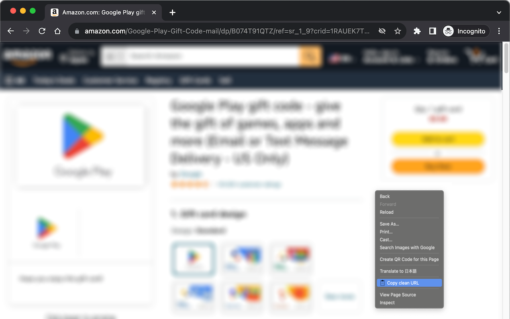

# ec-url-cleaner

A Chrome extension that copies clean URLs of Amazon product pages.



## How it works

If you're showing Amazon's product page like...

`https://www.amazon.com/What-Every-Thinks-About-Apart/dp/1849531986/ref=sr_1_1?crid=...` (very long URL)

You can get following URL to your clipboard from context (right-click) menu.

`https://www.amazon.com/dp/1849531986/`

This URL clearly does not include any tracking IDs, affiliate tags and other noisy parameters.

## Supported websites

Amazon.com, Amazon UK, Amazon Japan, and more.

See [manifest.json](manifest.json) for the complete list.

## Installation

### Chrome Web Store

This extension is available at Chrome Web Store:

> EC URL Cleaner
> 
> https://chromewebstore.google.com/detail/ec-url-cleaner/chjmklhdeoajccpinnhbibfbgjplnahi

Please give us a ⭐️⭐️⭐️⭐️⭐️ review if you like it.

### Local

See "Loading an unpacked extension" section of the Google's documentation:

> Chrome Extension development basics - Chrome for Developers
> https://developer.chrome.com/docs/extensions/mv3/getstarted/development-basics/

## Development

Install prettier and eslint:

```
pnpm i
```

Run prettier:

```
pnpm format
```

Run eslint:

```
pnpm eslint
```

Packaging to package.zip:

```
pnpm package
```

## License

[ISC](LICENSE)

## Author

[@mikan](https://github.com/mikan)
